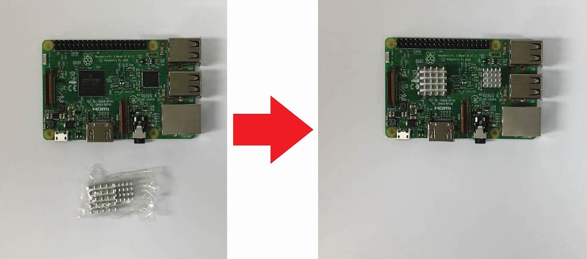
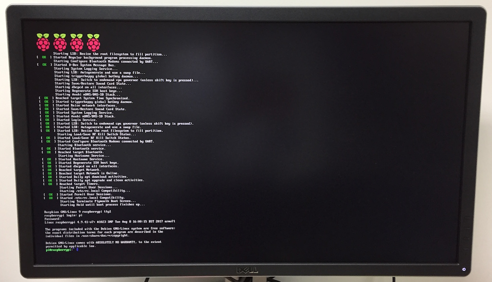
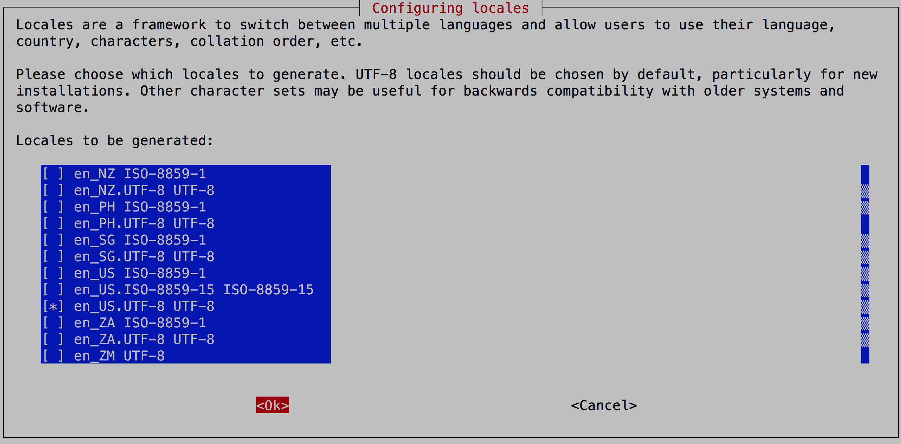
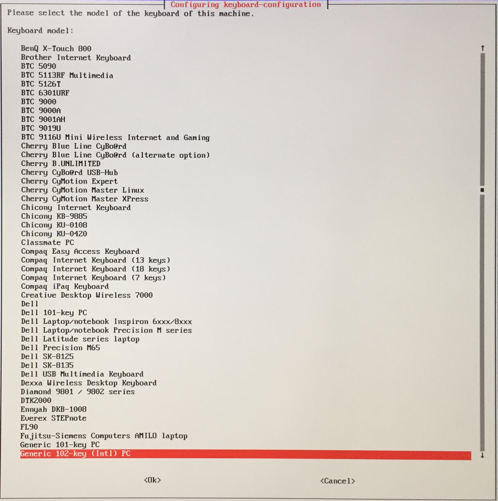

# PiTutorial

* Raspberry Pi tutorial for beginners.
* based on 
  * https://learn.adafruit.com/series/learn-raspberry-pi (original tutorial)
  * https://github.com/zhangshuo951227/raspberry-pi/wiki (updated for Jessie)
  * 2017 Summer Short Course 

---
# Lab 326 settings
* During the lab, you will work as a group of 2 (or 3) members. 
* Seat arrangement 
    * **Even** number: Raspberry Pi 
        * use HDMI, keyboard, mouse, (LAN) from the PC
        * **AFTER YOU'RE DONE. RECONNECT EVERYTHING BACK TO THE PC!**
    * **Odd** number: PC (do not remove anything from it). You will need this to google solutions for any troubles you may have. 
* We have WiFis for Raspberry Pi in 326 (during the lab) and 413 (24h). Access info is as follows. 
    * 326 (during the lab)
        * SSID/pw: RPI_5G / raspberrypi
        * SSID/pw: RPI / raspberrypi
    * 413
        * TO BE ANNOUNCED

# Lab 1. Intro to RPI
## Pre-lab Questions
```
Q. What is Raspberry Pi? 
Q. What is it good for? 
Q. What do you want to make using Raspberry Pi?
```

## Installation!

1. Attach heat sinks
    

2. Make Raspbian micro SD image
    * follow steps in https://learn.adafruit.com/adafruit-raspberry-pi-lesson-1-preparing-and-sd-card-for-your-raspberry-pi
    * You can download latest Raspbian image from https://www.raspberrypi.org/downloads/raspbian/ or from our e-larning system (week 2).
        * RASPBIAN STRETCH LITE: CLI only, preferred 
        * RASPBIAN STRETCH WITH DESKTOP: GUI included, but slow
        * Version:September 2017, Release date:2017-09-07, Kernel version:4.9
    * Insert the micro SD card to the slot in the back.
        
    * Connect the power, monitor (through HDMI), keyboard (through USB) to your RPI. Then, you will see four raspberries and many booting logs on your screen.
        
    * Log in with default id/pw
        * id: pi
        * pwd: raspberry

3. Configuring your RPI
    * Change password!
        ```bash
        passwd
        ```
        Account "pi" is an administrator. So, it's very important to use a strong password to secure you system. 

        It's also a good idea to make a new id that you like and make it an administrator. You can do it as follows.
        ```bash
        sudo adduser [ID YOU WANT]
        sudo adduser [ID YOU WANT] sudo
        ```
        
        Here, "sudo" is a special command (only for administrators) to change or set critical settings. Any sudo command requires authentification based on the password of the current your.
        
        System-critical operations can be done only by sudoers.
        
        For example, you can reboot with this command:
        ```bash
        sudo reboot
        ```
        
        You can shutdown the system with:
        ```bash
        sudo shutdown -h now
        ```
        It's a good idea to shutdown before you unplug the power. 
        
        
    * Using raspi-config
        In RPI, you can change any setting you like using command line commands. 
        There is an easier way. Execute: 
        ```bash
        sudo raspi-config
        ```
        You will see a menu for some common settings.
        
        
    * Enable SSH
    
        SSH is the standard way to connect any Linux-based machine. Using ssh, you can remotely connect to your RPI. So, let's turn it on.
        
        Run "raspi-config" and select "5 Interfacing Options" > "P2 SSH". Then, you can enable SSH.
        ```bash
        sudo raspi-config
        ```        
        
        

    * Change locale
    
        By default, RPI is set up for British English and British keyboards. The former may not a big problem, but the latter is. With default setting, you may not type special characters like " or #!
        So, let's change the locale using raspi-config. 
        
        Run "raspi-config" and select "4 Localization Options" > "I1 Change Locale"
        ```bash
        sudo raspi-config
        ```        
        
                
        
        Here, uncheck anything starting with "en_GB" and check "en_US.UTF-8 UTF-8."
        
        
        Set also default locale to "en_US.UTF-8 UTF-8." Then, wait for a while.
        

    
        ```bash
        sudo reboot
        ```    

    * Change keyboard layout
    
        Run "raspi-config" and select "4 Localization Options"> "I3 Change Keyboard layout". 
        Select "Generic 102-key", "English(US)", and default for the others. Then reboot.
        ```bash
        sudo raspi-config
        ```
        
        
        
        ```bash
        sudo reboot
        ```

    * For other settings, see https://learn.adafruit.com/adafruits-raspberry-pi-lesson-2-first-time-configuration
    
4. Network setup 
    * Because this is an "IoT" class, we will use WiFi.
    * But, unfortunately, the built-in WiFi has a serious compatibility issues with many WiFi APs. See [here](http://forums.rasplay.org/topic/196/공지-raspberrypi-model-3b-wifi-issue) more detail.
    * You have two solutions
        * Replace WiFI AP (which I did for rooms 326 and 413)
        * Add another WiFi donble 
    * In room 326, you can setup as follows to access the WiFi.
    
        **ADD** the following lines at the end of /etc/wpa_supplicant/wpa_supplicant.conf. (**DO NOT CHANGE THE FIRST THREE LINES!**)
        ```
        network={
        ssid="RPI_5G"
        psk="raspberrypi"
        priority=1
        }
        network={
        ssid="RPI"
        psk="raspberrypi"
        priority=2
        }
        ```


## Play with RPI
1. Change your hostname.

Hint: use "raspi-config" command

2. Change timezone.

Hint: use "raspi-config" command and see inside of localization options

3. Remotely connect your RPI using SSH.

4. Update your RPI

```bash
sudo apt-get update
sudo apt-get upgrade
```

---

# Git 

Git is the SW engineer's best friend!
Git is a modern version control system, which is an essential platform for SW development.
Github offers repositories for git and web-based tools for free!
Most open-source softwares are hosted on github, which became a de-facto reposotiry for collaborating and sharing your codes with the global community.
This week, you will learn how to use git and open an account on github.
From now on, all the codes will be submitted through github.com

## Online tutorial 
 * Beginner's guide: https://opentutorials.org/course/1492
 * (Optional) For advanced topics: https://opentutorials.org/course/2708
 * Markdown cheatsheet: https://github.com/adam-p/markdown-here/wiki/Markdown-Cheatsheet
 
## Exercise
  * Open an account on github.com.
  * Make a homepage linked with your github id on [YOUR-ID].github.io. (See https://pages.github.com for steps.)
  * Make a repository for your individual lab codes. Make a README.md with descrptions about your codes.
  * Make a repository for your team project. Make a README.md with descrptions about your codes.
  


---

# Lab 2. Python crash course

## Pre-lab Questions

## Programming with git!
  We will actively use git in our labs. Today, we will make full use of **1 PC + 1 RPI** setup in room 326.
  As shown in the following figure, your will write and test your python code on the desktop. After you're sure that code is ready to be run on RPI, you will get it and run it on RPI.
    
  
    
  1. Make a repository on github.com that you want to share with your teammate.

  2. Work on PC
    Clone the repository to the desktop and add a python code.
        
  3. Test on RPI
        
      First of all, you need to install git.    
      ```bash
      sudo apt install git
      ```
        
    Clone the repository to your RPI
    ```bash
    git clone [ADDRESS-OF-YOUR-REPOSITORY]
    ```
        
    Run and make any change you want.

    To submit changes you made to the repository,    
    ```bash 
    git commit [ANY CHANGE YOU MADE]
    ```
        
    ```bash
    git push
    ```
        

        
## Setting up python environment
https://github.com/ys7yoo/PiTutorial/blob/master/README.md#lab-2-python-crash-course

## Python 3 programming
https://github.com/ys7yoo/PyBasic#2-python-3-programming


# lab 3. 


