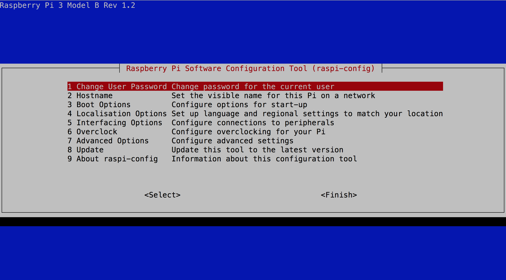
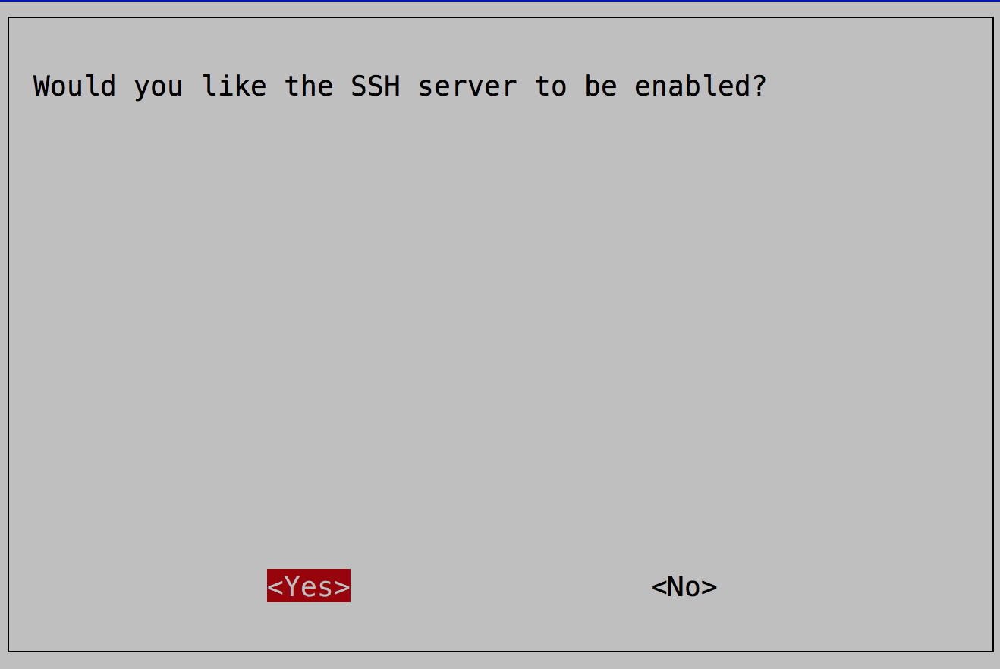
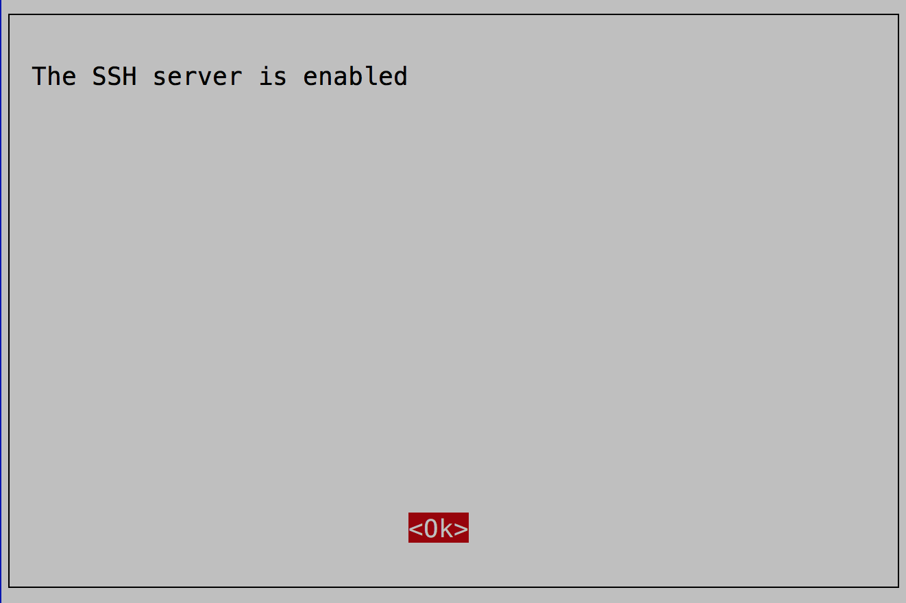

# PiTutorial

* Raspberry Pi tutorial for beginners.
* based on 
  * https://learn.adafruit.com/series/learn-raspberry-pi (original tutorial)
  * https://github.com/zhangshuo951227/raspberry-pi/wiki (updated for Jessie)
  * 2017 Summer Short Course 

---
  
# Lab 1. Intro to RPI
## Pre-lab Questions
```
Q. What is Raspberry Pi? 
Q. What is it good for? 
Q. What do you want to make using Raspberry Pi?
```

## Installation!

1. Attach heat sinks
    

2. Make Raspbian micro SD image
    * follow steps in https://learn.adafruit.com/adafruit-raspberry-pi-lesson-1-preparing-and-sd-card-for-your-raspberry-pi
    * You can download latest Raspbian image from https://www.raspberrypi.org/downloads/raspbian/.
        * RASPBIAN STRETCH LITE (Version:September 2017, Release date:2017-09-07, Kernel version:4.9)
    * Insert the micro SD card to the slot in the back.
        
    * Connect the power, monitor (through HDMI), keyboard (through USB) to your RPI. Then, you will see many booting logs on your screen.
        
    * Log in with default id/pw
        * id: pi
        * pwd: raspberry

3. Configuring your RPI
    * Change password!
        ```bash
        passwd
        ```
        Account "pi" is an administrator. So, it's very important to use a strong password to secure you system. 

        It's also a good idea to make a new id that you like and make it an administrator. You can do it as follows.
        ```bash
        sudo adduser [ID YOU WANT]
        sudo adduser [ID YOU WANT] sudo
        ```
        
        Here, "sudo" is a special command (only for administrators) to change or set critical settings. Any sudo command requires authentification based on the password of the current your.
        
    * Using raspi-config
        In RPI, you can change any setting you like using command line commands. 
        There is an easier way. Execute: 
        ```bash
        sudo raspi-config
        ```
        You will see a menu for some common settings.
        
    * Enable SSH
        SSH is the standard way to connect any Linux-based machine. Using ssh, you can remotely connect to your RPI. So, let's turn it on.
        
        Run "raspi-config" and select "5 Interfacing Options" > "P2 SSH". Then you can enable SSH.
        
        
        {:height="50%" width="50%"}
        {:height="50%" width="50%"}        
        
        
* https://learn.adafruit.com/adafruits-raspberry-pi-lesson-2-first-time-configuration
* https://learn.adafruit.com/adafruits-raspberry-pi-lesson-3-network-setup


## Play with RPI

---

# Git 

Git is the SW engineer's best friend!
Git is a modern version control system, which is an essential platform for SW development.
Github offers repositories for git and web-based tools for free!
Most open-source softwares are hosted on github, which became a de-facto reposotiry for collaborating and sharing your codes with the global community.
This week, you will learn how to use git and open an account on github.
From now on, all the codes will be submitted through github.com

## Online tutorial 
 * Beginner's guide: https://opentutorials.org/course/1492
 * (Optional) For advanced topics: https://opentutorials.org/course/2708
 * Markdown cheatsheet: https://github.com/adam-p/markdown-here/wiki/Markdown-Cheatsheet
 
## Exercise
  * Make an account on github.com.
  * Make a homepage linked with your github id on github.io. (See https://pages.github.com for steps.)
  * Make a repository for your lab codes. Make a README.md with descrptions about your codes.
  * Make a repository for your team project. Make a README.md with descrptions about your codes.
  


---

# Lab 2. Python crash course

## Pre-lab Questions

## Setting up python environment
https://github.com/ys7yoo/PiTutorial/blob/master/README.md#lab-2-python-crash-course

## Python 3 programming
https://github.com/ys7yoo/PyBasic#2-python-3-programming


# lab 3. 


