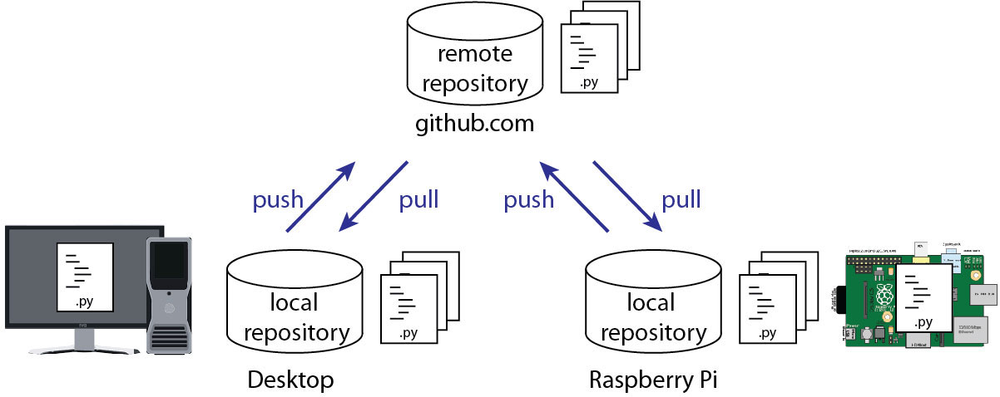

# Lab 2. Python crash course

## Pre-lab Questions
1. Why Python?

   Read an article [here](https://stackoverflow.blog/2017/09/06/incredible-growth-python/) about Python.
   Summarize why Python is so popular these days.

2. Set up Python development environment in your PC

   You can follow a quick tutorial in https://github.com/ys7yoo/PyBasic#1-setting-up-python-environment.
   
3. Review git commands (clone, commit, push, pull)


## Working with git!

We will actively use git in our labs. 

Today, we will make full use of **1 PC + 1 RPI** setup in room 326.
As shown in the following figure, your will write and test your python code on the desktop. After you're sure that code is ready to be run on RPI, you will get it and run it on RPI.
    

    
### Step 1. Make a repository on github.com that you want to share with your teammate.

1. Go to [github.com](https://github.com) and log in. 

2. Click "New repository" button to create a new one. 

3. Create a README.md file!

4. Add your teammate as a collaborator of the repository

   In the repository you made, you can add a collaborator from "Settings" > " "Collaboratiors" menu.
   


### Step 2. Work on PC

0. Install Git for windows (or Source Tree)

1. Clone the repository to the desktop.

```bash
git clone [ADDRESS OF YOUR REPOSITORY]
cd [NAME OF THE REPOSITORY]
```

2. Add a python code.

3. Commit your work and push it to the repository.

```bash
git commit [ANY CHANGE YOU MADE]
git push
```

### Step 3. Test on RPI
1. First of all, you need to install git.

```bash
sudo apt install git
```

2. Clone the repository to your RPI.

```bash
git clone [ADDRESS OF YOUR REPOSITORY]
cd [NAME OF THE REPOSITORY]
```

3. Run and make any change you want.

4. To submit changes you made to the repository,

```bash
git commit [ANY CHANGE YOU MADE]
git push
```

## Python 3 programming

Now, let's start Python programming!

https://github.com/ys7yoo/PyBasic#2-python-3-programming
